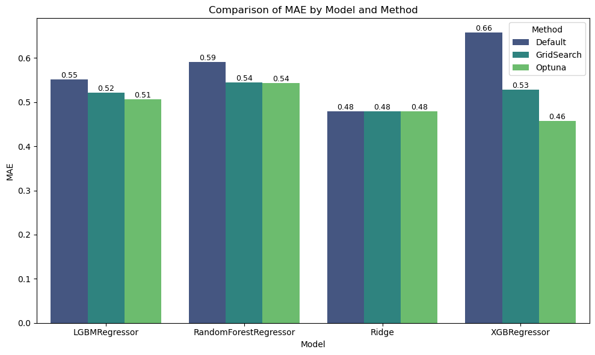

# Geothermal Well Property Prediction Framework

## Executive Summary
- **Optuna Optimization** consistently outperformed Default and GridSearch approaches, yielding the lowest NMSE, MAPE, and MAE across all models.
- **XGBRegressor**, optimized with Optuna, demonstrated the most significant improvement, transitioning from negative R² to positive values, with reduced bias and error magnitude.
- **Ridge Regression** maintained consistent and stable performance, serving as a robust baseline.
- These findings confirm the framework's effectiveness in leveraging hyperparameter optimization for geothermal property prediction.
- **Practical Implications**: The framework demonstrates significant potential for application in geothermal energy exploration and other depth-based prediction domains.

---

## Overview
A robust framework for predicting geothermal properties using well logs, with a focus on generalization, transparency, and real-world adaptability. 

This project began as a collaboration with a PhD student at TU Delft, who provided the lab data from four Permian wells in the Netherlands. The entire framework, including data preprocessing, model development, and evaluation, was designed and implemented independently to explore the feasibility of predicting geothermal properties with machine learning.

This framework was inspired by the importance of strong framework development learned during my Master’s thesis at TU Delft ([Thesis Link](https://repository.tudelft.nl/record/uuid:873cc936-d799-40c6-97d5-b168012ad090)). The methodology reflects the rigor and reproducibility essential in scientific research.

---

## Key Features
- **Well-Based Splitting**: Ensures no data leakage by splitting wells between training and testing sets.
- **Advanced Interpolation**: Aligns log and lab data across depths, enriching the dataset and handling missing values (PCHIP) ([Reference Link](https://repository.tudelft.nl/record/uuid:5a4e8467-3eca-4815-86db-7d4a86603bad)).
- **Custom Metrics**: Evaluates performance using:
  - **MAE** (Mean Absolute Error): Measures the average magnitude of errors.
  - **MAPE** (Mean Absolute Percentage Error): Provides error as a percentage of the true value.
  - **NMSE** (Normalized Mean Squared Error): Scales MSE by the variance of the target.
  - **R²** (Coefficient of Determination): Indicates the proportion of variance explained by the model.
  - **Ensemble Metric**: Combines error and bias to provide a holistic view of model performance:
    \[
    \text{Ensemble Metric} = \text{MAE} + |\text{Bias}|
    \]
    where:
    - \( \text{MAE} = \frac{1}{n} \sum_{i=1}^n |y_i - \hat{y}_i| \)
    - \( \text{Bias} = \frac{1}{n} \sum_{i=1}^n (\hat{y}_i - y_i) \)
    - \( y_i \) is the true value, \( \hat{y}_i \) is the predicted value, and \( n \) is the number of observations.
- **Hyperparameter Optimization**: Employs Optuna and GridSearch for fine-tuning.
- **Scalability**: Adapts seamlessly to new data and properties.

---

## Goals
- **Generalization and Transparency**: Designed for real-world applicability and reproducibility.
- **Adaptability**: Built to scale with new wells and properties.
- **Versatility**: The framework is applicable not only to geothermal properties but also to other datasets and problems requiring depth-based predictions.

---

## Project Structure
```
ML-Geothermal/
├── data/
│   ├── raw/                                   # Raw well log and lab data
│   ├── processed/                             # Cleaned and processed datasets
│   ├── results/                               # Results such as model outputs and predictions
├── geothermal_prediction/
│   ├── __init__.py                            # Initialize the module
│   ├── data_loader.py                         # Load and preprocess raw data
│   ├── preprocessing.py                       # Data cleaning and merging
│   ├── ml_well_gridsearch.py                  # GridSearch-based hyperparameter tuning
│   ├── ml_well_optuna.py                      # Optuna-based hyperparameter tuning
│   ├── utils.py                               # Utility functions for saving files
│   ├── visualization.py                       # Visualization utilities
│   └── well_interpolation.py                  # Interpolation for missing well data
├── notebooks/
│   ├── 01_well_log_properties.ipynb           # Log selection and preprocessing
│   ├── 02_lab_data.ipynb                      # Clean and analyze lab data
│   ├── 03_merge_lab_log.ipynb                 # Merge logs with lab data
│   ├── 04_eda.ipynb                           # Exploratory data analysis
│   ├── 05_ml_default_modeling.ipynb           # Machine learning with default settings
│   ├── 06_ml_gridsearch_modeling.ipynb        # GridSearch optimization
│   ├── 07_ml_optuna_modeling.ipynb            # Optuna optimization
│   ├── 08_results_analysis.ipynb              # Results and Analysis
├── README.md                                  # Project documentation
├── requirements.txt                           # Dependencies
```

---

## How to Use
1. **Setup**
   - Clone the repository and install dependencies:
     ```bash
     pip install -r requirements.txt
     ```

2. **Steps**
   - **Prepare Data**: Place raw well logs and lab data into `data/raw/`.
     - **Log Data**: Ensure that the log data is organized into separate folders for each well inside `data/raw/logs/`, as shown below:
       ```
       data/raw/logs/
       ├── E18-05/
       │   ├── file1.las
       │   ├── file2.las
       ├── K18-07x/
       │   ├── file1.las
       │   ├── file2.las
       ├── ...
       ```
       Each folder should contain `.las` files for the corresponding well. These files are used to extract the logs and create the dataset for each well.
   - **Run Notebooks**: Execute the following notebooks in order:
     1. `01_well_log_properties.ipynb`
     2. `02_lab_data.ipynb`
     3. `03_merge_lab_log.ipynb`
     4. `04_eda.ipynb`
   - **Model Training**: Use notebooks for default (`05_ml_default_modeling.ipynb`), GridSearch (`06_ml_gridsearch.ipynb`), or Optuna (`07_ml_optuna.ipynb`) modeling.
      - **Default Modeling**: Establishes a baseline for each model using default parameters. This serves two purposes:
         1. Provides a reference point to evaluate model performance.
         2. Allows comparison with results from hyperparameter tuning to assess improvements.
      - **GridSearch and Optuna**: Perform systematic and efficient hyperparameter tuning, aiming to improve upon the baseline established in the default modeling step.

---

## Workflow
1. **Data Preparation**
   - Standardizes log names and units.
   - Merges well logs with laboratory data.
   - Aligns datasets using advanced interpolation techniques.

2. **Machine Learning Framework**
   - **Train-Test Split**: Ensures robust validation with GroupKFold.
   - **Model Tuning**: Includes both GridSearch and Optuna for hyperparameter optimization.
   - **Models Supported**: Ridge Regression, Random Forest, LightGBM, XGBoost.

3. **Evaluation**
   - Visualizes residuals and true vs. predicted values.
   - Analyzes feature importance and coefficients.
   - **Cross-Validation**: Results are derived from cross-validation folds due to the lack of an external blind test set. 
   - **Blind Well Testing**: While blind well testing was not performed in this framework due to the limited number of wells, it is a critical step for robust external validation. The trained model can be saved and later evaluated on reserved blind wells to ensure real-world applicability and generalization.

---

## Results
### Default Modeling
- Establishes baseline performance with interpretable results.
- Highlights areas for improvement through residual analysis.

### GridSearch Optimization
- Enhances model performance via systematic hyperparameter tuning.
- Reduces residual biases and improves predictive accuracy.

### Optuna Optimization
- Demonstrates the most substantial gains across all metrics, particularly for XGBRegressor:
  - Reduced NMSE and MAPE to their lowest levels.
  - Transitioned XGBRegressor's R² from negative to positive values, indicating better explanatory power.
  - Delivered the tightest residual distributions and aligned predictions closely with true values.

### Summary Metrics
Below are key performance metrics across models and methods:




### Residual Analysis and Predictions (Optuna)
The following plots highlight the residual distributions and true vs. predicted values for the **Optuna-optimized models**:

- **Residual Analysis (Th_Cond)**:
  

- **Residual Analysis (Th_Diff)**:
  

- **True vs. Predicted Values**:
  

---

## Challenges and Limitaitons
- **Small Dataset**: Limited to four wells, constraining generalization.
- **Interpolation Bias**: Techniques like PCHIP might introduce smoothing biases, potentially obscuring localized geological variations.
- **Well-Specific Variability**: Performance varies across wells due to geological differences.
- **Blind Test Absence**: While cross-validation guarantees transparency, having a blind test set for external validation is critical for production-level deployment.


---

## Conclusions
- This project demonstrates the feasibility of predicting geothermal properties with machine learning, even with limited data.
- While high performance is constrained by the small dataset, the framework guarantees robustness, transparency, and generalization.
- The methodology can be seamlessly applied to more comprehensive datasets, making it adaptable for future research and real-world applications.
- By prioritizing best practices such as well-based splitting, interpolation, and reproducibility, this framework serves as a strong foundation for predictive modeling in geothermal studies and beyond.

---

## Future Directions and Recommendations
1. **Incorporate Blind Test Wells**: Set aside some wells as a blind test set for final evaluation to ensure generalization and robustness.

2. **Evaluate Additional Metrics**: Experiment with alternative optimization metrics, such as NMSE and Ensemble Metric, to identify the most effective metric for predictions.

3. **Expand the Dataset**: Incorporate data from additional wells to improve robustness and enable better generalization.

4. **Enhance Feature Engineering**:
   - Introduce lagged features, percentage changes, and other time-series techniques to capture temporal dependencies.
   - Explore interactions between geological and temporal features for enhanced predictive power.

5. **Domain Expert Input**: Collaborate with geoscientists to validate whether the interpolated features are geologically plausible.

---

## Acknowledgments
Special thanks to TU Delft and the collaborating PhD student for providing the lab data and inspiring this project. The opportunity to work with this data allowed me to independently design and develop the framework, applying best practices learned to create a robust and adaptable solution.
